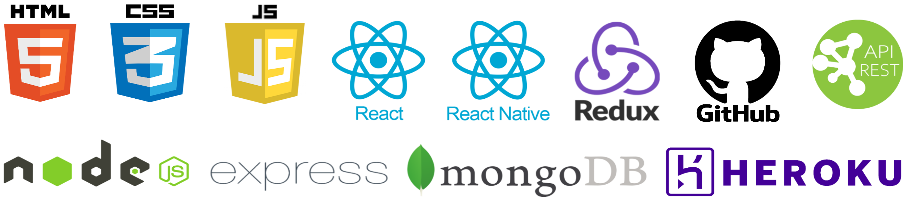

 # ✨ Développeur JS   back, front et mobile  

#### Ma stack :   

 

🎓 Diplôme RNCP niv 6 en développement web et mobile obtenu à [La Capsule 🚀](https://www.linkedin.com/feed/update/urn:li:activity:6714913864439369728/)  
 
🥋 4ème Kyu en kata JS (ce qui sert finalement peu en street fight)   
 
🙏 Toujours en recherche de progression et de "best practices", j’apprécie les retours  
  
🔎 Technos en cours d'exploration : Firebase / GraphQL / Tailwind / TypeScript / TDD  
 
😮 Fun fact : avant d'être développeur, j'ai été conseiller financier puis auteur et comédien
 
 

    

 
 
 

